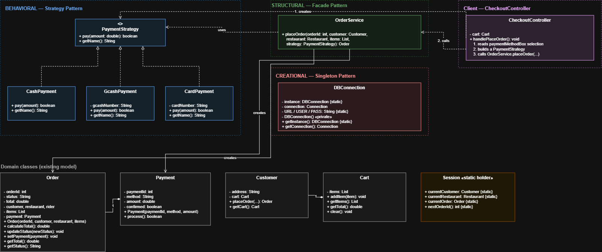

# Capstone Food Delivery System

A JavaFX-based food delivery application where users can register, log in as a Customer or Rider, browse restaurants, add menu items to a cart, place and track orders, and rate completed deliveries. The system uses a MySQL database (via XAMPP) for data storage and Java Serialization for user session management.

## Major Features

- User registration and login with database validation (Customer and Rider roles)
- Browse restaurants and add menu items to a cart
- Checkout with multiple payment methods (Cash on Delivery, GCash, Credit Card)
- Order tracking and rider delivery view
- Order rating with stars and comments
- Persistent user sessions using Java Serialization
- Logout with automatic session file deletion

## Serialization Mechanism (Session Management)

The system implements user session management through **Java Serialization**:

1. **Session Creation** – Upon a successful login, `LoginController` calls `SessionManager.createSession()`, which serializes a `SessionData` object (the logged-in user's id, name, email, phone, address, and role) into a file named `session.dat` using `ObjectOutputStream`.
2. **Session Validation** – While navigating the system, screens validate the session by deserializing `session.dat` through `SessionManager.getSession()` / `SessionManager.isLoggedIn()` using `ObjectInputStream`. For example, `RiderController` redirects to the login screen if no valid session file exists, and the logged-in user's information (such as the welcome message) is read from the deserialized `SessionData` object.
3. **Session Deletion** – Upon logout, `LoginController.clearLoginSession()` calls `SessionManager.destroySession()`, which automatically deletes `session.dat`, and the user is redirected back to the login screen.

The `SessionData` class implements the `Serializable` interface with a declared `serialVersionUID` to ensure version compatibility during deserialization.

## SOLID Principles Applied

### 1. Single Responsibility Principle (SRP)

**Classes involved:** `SessionManager`, `MySqlUserRepository`, `LoginController`

Each class has exactly one responsibility:

- `SessionManager` handles only session file creation, validation, and deletion.
- `MySqlUserRepository` handles only database access (the SQL query for authenticating users). This code was previously inside `LoginController` and was moved out to separate database access from UI logic.
- `LoginController` and the other controllers handle only UI logic and user interaction.

**Benefit:** Database code, session logic, and UI logic are fully separated. A change to the database query never affects session handling or the UI code, making the system easier to maintain, debug, and extend.

### 2. Dependency Inversion Principle (DIP)

**Classes involved:** `UserRepository` (interface), `MySqlUserRepository` (implementation), `LoginController`

`LoginController` does not depend directly on the concrete MySQL class. It depends on the `UserRepository` interface, and `MySqlUserRepository` implements that interface:

```
LoginController  →  UserRepository (interface)  ←  MySqlUserRepository (implementation)
```

**Benefit:** The high-level module (the controller) is decoupled from the low-level module (the database code). The data source can be swapped, for example to a file-based store or a mock repository for testing, without changing any controller code, which reduces class dependencies and improves testability.

## Design Patterns Applied

This project implements three design patterns — one from each of the three GoF categories (Creational, Structural, Behavioral).

### 1. Creational — Singleton

**Class involved:** `DBConnection`

`DBConnection` ensures only one database connection object exists for the entire application. Its constructor is `private`, a single `static` instance is held internally, and the global access point `getInstance()` creates it lazily on first use and returns that same object on every later call.

**Benefit:** Every repository and controller shares one MySQL connection instead of opening a new one each time, which avoids connection leaks and wasted resources.

```
Connection conn = DBConnection.getInstance().getConnection();
```

### 2. Structural — Facade

**Class involved:** `OrderService`

`OrderService` provides a single simplified entry point, `placeOrder(...)`, that hides the multi-step checkout process behind one call: building the `Order`, running the chosen payment method, recording the `Payment`, and setting the final order status.

**Benefit:** `CheckoutController` calls one method instead of orchestrating the order, payment, and status subsystems itself, keeping the UI layer thin and decoupled from the internal order-processing logic.

```
Order order = new OrderService().placeOrder(
        Session.nextOrderId(), customer, restaurant, items, strategy);
```

### 3. Behavioral — Strategy

**Classes involved:** `PaymentStrategy` (interface), `CashPayment`, `GcashPayment`, `CardPayment`

`PaymentStrategy` defines a common interface with three interchangeable implementations. The payment method is chosen at runtime from the checkout screen's dropdown, and the rest of the code works against the interface without knowing which concrete method is used.

**Benefit:** A new payment method can be added by writing one more class that implements `PaymentStrategy`, with no changes to `OrderService` or `CheckoutController` (open/closed principle).

```
PaymentStrategy strategy = new GcashPayment(customer.getPhone());
boolean paid = strategy.pay(order.getTotal());
```

## Design Patterns UML



## Technologies Used

- Java / JavaFX (FXML) for the GUI
- MySQL via XAMPP
- Java Serialization (`ObjectOutputStream` / `ObjectInputStream`)
- Maven